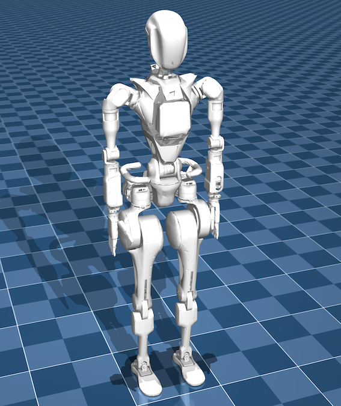

# Wiki-MJCF




Welcome to the Fourier Intelligence Wiki-MJCF Repository!

This repository provides a tool to transfer from URDF file to MJCF. It is developed for converting the GRx robot URDF files to MJCF files.
However, it can also be used for other URDF files.

## User Guide

1. Install the package using pip:

```shell
pip install mujoco
pip install -e .
```

2. Test the package:

```shell
urdf2mjcf --help
```

```
usage: urdf2mjcf [-h] [-s SENSOR_CONFIG] [-m MUJOCO_NODE] [--ground] [--lighting] [--version] [-l] [urdf] [mjcf]

Copyright (c) 2022 Fraunhofer IPA; use option '-l' to print license.

Parse a URDF model into MJCF format

positional arguments:
  urdf              the URDF file to convert (default: <_io.TextIOWrapper name='<stdin>' mode='r' encoding='utf-8'>)
  mjcf              the converted MJCF file (default: <_io.TextIOWrapper name='<stdout>' mode='w' encoding='utf-8'>)

optional arguments:
  -h, --help        show this help message and exit
  -s SENSOR_CONFIG  the XML file of the sensor configuration (default: None)
  -m MUJOCO_NODE    the XML file defining the global MuJoCo configuration (default: None)
  --ground          whether to add the default ground plane to the MuJoCo model (default: False)
  --lighting        whether to add the default lighting to the MuJoCo model (default: False)
  --version         show program's version number and exit
  -l                print license information (default: False)
```

3. Convert a URDF file to MJCF:

```shell
urdf2mjcf /path/to/models /path/to/mjcf
```

4. Example: convert GR1T1 robot to MJCF:

```shell
# GR1T1 is the model collision has been simplified
urdf2mjcf ./models/GR1/GR1T1/urdf/GR1T1.urdf ./models/GR1/GR1T1/mjcf/GR1T1.mjcf --ground --lighting

# GR1T1_raw is the model with the original collision
urdf2mjcf ./models/GR1/GR1T1/urdf/GR1T1_raw.urdf ./models/GR1/GR1T1/mjcf/GR1T1_raw.mjcf --ground --lighting

# GR1T2_raw is the model with the original collision
urdf2mjcf ./models/GR1/GR1T2/urdf/GR1T2_raw.urdf ./models/GR1/GR1T2/mjcf/GR1T2_raw.mjcf --ground --lighting
```

5. Change base height of the robot:
    - Edit `<body name="base">` in the MJCF file.
    ```
    <body name="base" pos="0 0 0.95">
    ```

6. Refine the MJCF file:
    - The MJCF file generated by the tool is a basic version. You can manually refine the MJCF file according to your requirements.
    - We have provided the refined MJCF files in the repository path:
        - `./models/mujoco_menagerie/fourier_intelligence_gr1t1/gr1t1.mjcf`
        - `./models/mujoco_menagerie/fourier_intelligence_gr1t2/gr1t2.mjcf`

## Verification

If you want to verify the output mjcf file, you can refer to the following repository:

- [Wiki-GRx-Mujoco in Github](https://gitee.com/FFTAI/wiki-grx-mujoco/)
- [Wiki-GRx-Mujoco in Gitee](https://gitee.com/FourierIntelligence/wiki-grx-mujoco/)

---

## Known Issues

### ModuleNotFoundError: No module named 'defusedxml'

Problem:

```
/home/fftai/miniconda3/envs/wiki-mjcf/bin/urdf2mjcf:4: DeprecationWarning: pkg_resources is deprecated as an API. See https://setuptools.pypa.io/en/latest/pkg_resources.html
  __import__('pkg_resources').require('urdf2mjcf==2.0.4')
Traceback (most recent call last):
  File "/home/fftai/miniconda3/envs/wiki-mjcf/bin/urdf2mjcf", line 7, in <module>
    exec(compile(f.read(), __file__, 'exec'))
  File "/home/fftai/Repository/wiki-mjcf/scripts/urdf2mjcf", line 7, in <module>
    from urdf2mjcf.app import full_pipeline
  File "/home/fftai/Repository/wiki-mjcf/src/urdf2mjcf/app.py", line 1, in <module>
    from .core import Element, RosPack
  File "/home/fftai/Repository/wiki-mjcf/src/urdf2mjcf/core.py", line 12, in <module>
    from defusedxml.ElementTree import parse
ModuleNotFoundError: No module named 'defusedxml'
```

Solution:

```shell
pip install defusedxml
```

### ModuleNotFoundError: No module named 'rospkg'

Problem:

```
/home/fftai/miniconda3/envs/wiki-mjcf/bin/urdf2mjcf:4: DeprecationWarning: pkg_resources is deprecated as an API. See https://setuptools.pypa.io/en/latest/pkg_resources.html
  __import__('pkg_resources').require('urdf2mjcf==2.0.4')
Traceback (most recent call last):
  File "/home/fftai/miniconda3/envs/wiki-mjcf/bin/urdf2mjcf", line 7, in <module>
    exec(compile(f.read(), __file__, 'exec'))
  File "/home/fftai/Repository/wiki-mjcf/scripts/urdf2mjcf", line 7, in <module>
    from urdf2mjcf.app import full_pipeline
  File "/home/fftai/Repository/wiki-mjcf/src/urdf2mjcf/app.py", line 1, in <module>
    from .core import Element, RosPack
  File "/home/fftai/Repository/wiki-mjcf/src/urdf2mjcf/core.py", line 14, in <module>
    from rospkg import RosPack
ModuleNotFoundError: No module named 'rospkg'
```

Solution:

```shell
pip install rospkg
```

## Thanks

- https://github.com/balandbal/urdf2mjcf

---

Thank you for your interest in the Fourier Intelligence GRx Robot Repositories.
We hope you find this resource helpful in your robotics projects!
